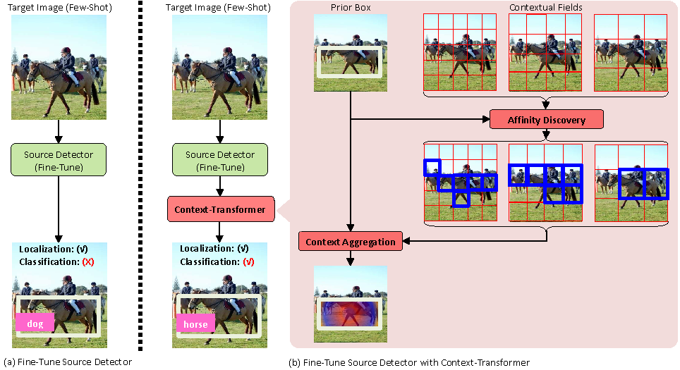

# Context-Transformer: Tackling Object Confusion for Few-Shot Detection

By Ze Yang, Yali Wang, Xianyu Chen, Jianzhuang Liu, Yu Qiao.


## Introduction
To tackle the object confusion problem in few-shot detection, we propose a novel Context-Transformer within a concise deep transfer framework. Specifically, Context-Transformer can effectively leverage source-domain object knowledge as guidance, and automatically formulate relational context clues to enhance the detector's generalization capcity to the target domain.
It can be flexibly embedded in the popular SSD-style detectors, which makes it a plug-and-play module for end-to-end few-shot learning. For more details, please refer to our [AAAI paper](https://arxiv.org/pdf/2003.07304.pdf).

<p align=center></p>


### Transfer Setting COCO60 to VOC20 (Novel Class *mAP*)
| Method |  *1shot* | *5shot* |
|:-------|:-----:|:-------:|
| [Prototype](https://github.com/ShaoqingRen/faster_rcnn) | 22.8 | 39.8 |
| [Imprinted](http://pjreddie.com/darknet/yolo/) | 24.5 | 40.9 |
| [Non-local](https://github.com/daijifeng001/R-FCN)| 25.2 | 41.0 |
| Ours | **27.0** | **43.8** |


### Incremental Setting VOC15 to VOC20 (Novel Class *mAP*)
| Method (*1-shot*) | *Split1* | *Split2* | *Split3* |
|:-------|:-------:|:-----:|:-------:|
| [Shmelkov2017](https://arxiv.org/pdf/1708.06977.pdf) | 23.9 | 19.2 | 21.4 |
| [Kang2019](https://arxiv.org/pdf/1812.01866.pdf) | 14.8 | 15.7 | 19.2 |
| ours | **39.8** | **32.5** | **34.0** |

| Method (*5-shot*) | *Split1* | *Split2* | *Split3* |
|:-------|:-------:|:-----:|:-------:|
| [Shmelkov2017](https://arxiv.org/pdf/1708.06977.pdf) | 38.8 | 32.5 | 31.8 |
| [Kang2019](https://arxiv.org/pdf/1812.01866.pdf) | 33.9 | 30.1 | 40.6 |
| ours | **44.2** | **36.3** | **40.8** |

Note:
- The results here is higher than that reported in the paper due to training strategy adjustment.


### License

Context-Transformer is released under the MIT License (refer to the LICENSE file for details).


### Citing Context-Transformer

If you find Context-Transformer useful in your research, please consider citing:
```BibTeX
@misc{yang2020contexttransformer,
    title={Context-Transformer: Tackling Object Confusion for Few-Shot Detection},
    author={Ze Yang and Yali Wang and Xianyu Chen and Jianzhuang Liu and Yu Qiao},
    year={2020},
    eprint={2003.07304},
    archivePrefix={arXiv},
    primaryClass={cs.CV}
}
```
&nbsp;

## Contents
1. [Installation](#installation)
2. [Datasets](#datasets)
3. [Training](#training)
4. [Evaluation](#evaluation)

## Installation
- Clone this repository. This repository is mainly based on [RFBNet](https://github.com/ruinmessi/RFBNet) and [Detectron2](https://github.com/facebookresearch/detectron2), many thanks to them.
- Install [anaconda](https://www.anaconda.com/distribution/) and requirements:
    - python 3.6
    - PyTorch 1.4.0
    - CUDA 10.0
    - gcc 5.4
    - cython
    - opencv
    - matplotlib
    - tabulate
    - termcolor
    - tensorboard

        You can setup the entire environment simply using `conda`:

        ```sh
        conda create -n CT python=3.6 && conda activate CT
        conda install pytorch torchvision cudatoolkit=10.0 -c pytorch
        conda install cython opencv matplotlib tabulate termcolor tensorboard
        ```

- Compile the nms and coco tools:
```Shell
sh make.sh
```

Note: 
- Check your GPU architecture support in utils/build.py, line 131. Default is:
``` 
'nvcc': ['-arch=sm_61',
``` 
- Ensure that the cuda environment is integrally installed, including compiler, tools and libraries. Plus, make sure the cudatoolkit version in the conda environment matches with the one you compile with. Check about that using `nvcc -V` and `conda list | grep cudatoolkit`, the output version should be the same.
- We have test the code on PyTorch-1.4.0 and Python 3.6. It might be able to run on other versions but with no guarantee.

## Datasets
### VOC Dataset
#### Download VOC2007 trainval & test

```Shell
# specify a directory for dataset to be downloaded into, else default is ~/data/
sh data/scripts/VOC2007.sh # <directory>
```

#### Download VOC2012 trainval

```Shell
# specify a directory for dataset to be downloaded into, else default is ~/data/
sh data/scripts/VOC2012.sh # <directory>
```
#### Create symlink for the VOC dataset:
```
ln -s /path/to/VOCdevkit data/VOCdevkit
```
#### Image shots and splits preparation
Move the Main2007.zip and Main2012.zip under `data/` folder to `data/VOCdevkit/VOC2007/ImageSets/` and `data/VOCdevkit/VOC2012/ImageSets/` respectively, and unzip them. Make sure that the .txt files contained in the zip file are under corresponding `path/to/Main/` folder.

### COCO Dataset
#### Download COCO benchmark
Download the MS COCO dataset from [official website](http://mscoco.org/) to `data/COCO/` (or make a symlink `ln -s /path/to/coco data/COCO`). All annotation files (.json) should be placed under the `COCO/annotations/` folder. It should have this basic structure
```Shell
$COCO/
$COCO/cache/
$COCO/annotations/
$COCO/images/
$COCO/images/train2014/
$COCO/images/val2014/
```
Note: The current COCO dataset has released new *train2017* and *val2017* sets which are just new splits of the same image sets. 
#### Image splits preparation
Run the following command to obtain nonvoc/voc split annotation files (.json): 
```
python data/split_coco_dataset_voc_nonvoc.py
```

## Training
First download the fc-reduced [VGG-16](https://arxiv.org/abs/1409.1556) PyTorch base network weights at https://s3.amazonaws.com/amdegroot-models/vgg16_reducedfc.pth
or from [BaiduYun Driver](https://pan.baidu.com/s/1jIP86jW), and place it under the directory `weights/`.

### Phase 1
#### Transfer Setting
To pretrain RFBNet on source domain dataset COCO60:
```Shell
python train.py --save-folder weights/COCO60_pretrain -d COCO -p 1
```

#### Incremental Setting
To pretrain RFBNet on VOC split1 (simply change `--split` for other splits):
```Shell
python train.py --save-folder weights/VOC_split1_pretrain -d VOC -p 1 -max 50000 --steps 30000 40000 --checkpoint-period 4000 --warmup-iter 1000 --setting incre --split 1
```
Note:
- To ease your reproduce, feel free to download the above pretrained RFBNet models via [BaiduYun Driver](https://pan.baidu.com/s/1aW73KRm3anrX0ulcadQZMg) 
or [OneDrive](https://entuedu-my.sharepoint.com/:f:/g/personal/ze001_e_ntu_edu_sg/Ep1kRewPKKJCi0hIrAcyRKsBKm4q78TdZDh_O-cwfeQs-A?e=X9uk5r) directly.

### Phase 2
#### Transfer Setting
To finetune on VOC dataset *(1 shot)*:
```Shell
python train.py --load-file weights/COCO60_pretrain/model_final.pth --save-folder weights/fewshot/transfer/VOC_1shot -d VOC -p 2 --shot 1 --method ours -max 2000 --steps 1500 1750 --checkpoint-period 200 --warmup-iter 0 --no-mixup-iter 750 -b 20
```
To finetune on VOC dataset *(5 shot)*:
```Shell
python train.py --load-file weights/COCO60_pretrain/model_final.pth --save-folder weights/fewshot/transfer/VOC_5shot -d VOC -p 2 --shot 5 --method ours -max 4000 --steps 3000 3500 --checkpoint-period 500 --warmup-iter 0 --no-mixup-iter 1500
```


#### Incremental Setting
To finetune on VOC dataset for split1 setting *(1 shot)*:
```Shell
python train.py -d VOC --split 1 --setting incre -p 2 -m ours --shot 1 --save-folder weights/fewshot/incre/VOC_split1_1shot --load-file weights/VOC_split1_pretrain/model_final.pth -max 200 --steps 150 --checkpoint-period 50 --warmup-iter 0 --no-mixup-iter 100
```
To finetune on VOC dataset for split1 setting *(5 shot)*:
```Shell
python train.py -d VOC --split 1 --setting incre -p 2 -m ours --shot 5 --save-folder weights/fewshot/incre/VOC_split1_5shot --load-file weights/VOC_split1_pretrain/model_final.pth -max 400 --steps 350 --checkpoint-period 50 --warmup-iter 0 --no-mixup-iter 100
```
Note:
- Simply change `--split` for other split settings.
- For other shot settings, feel free to adjust `--shot`, `-max`, `--steps` and `--no-mixup-iter` to obtain satisfactory results.

## Evaluation
### Phase 1
#### Transfer Setting
To evaluate the pretrained model on COCO minival set:
```Shell
python test.py -d COCO -p 1 --save-folder weights/COCO60_pretrain --resume
```
#### Incremental setting
To evaluate the pretrained model on VOC2007 test set (specify your target split via `--split`):
```Shell
python test.py -d VOC --split 1 --setting incre -p 1 --save-folder weights/VOC_split1_pretrain --resume
```
### Phase 2
#### Transfer Setting
To evaluate the transferred model on VOC2007 test set:
```Shell
python test.py -d VOC -p 2 --save-folder weights/fewshot/transfer/VOC_5shot --resume
```
#### Incremental setting
To evaluate the incremental model on VOC2007 test set (specify your target split via `--split`):
```Shell
python test.py -d VOC --split 1 --setting incre -p 2 --save-folder weights/fewshot/incre/VOC_split1_5shot --resume
```
Note:
- --resume: load model from the last checkpoint in the folder `--save-folder`.

If you would like to manually specify the path to load model, use `--load-file path/to/model.pth` instead of `--resume`.

&nbsp;

Should you have any questions regarding this repo, feel free to email me at ze001@e.ntu.edu.sg.
